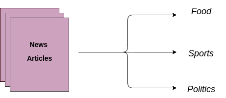

# Data Science Portfolio
---
## Machine learning

### Bike sharing using linear regression

A bike-sharing system is a service in which bikes are made available for shared use to individuals on a short term basis for a price or free. Many bike share systems allow people to borrow a bike from a "dock" which is usually computer-controlled wherein the user enters the payment information, and the system unlocks it. This bike can then be returned to another dock belonging to the same system.

---
### Heart desease prediction using Decision Tree

Buid a decision tree classifier to predict weather patient will be vulnerable to heart problems or not.

---
### Online Retail customer segmentation using K-Means algorithm

Customer Segmentation is the subdivision of a market into discrete customer groups that share similar characteristics. Customer Segmentation can be a powerful means to identify unsatisfied customer needs. Using the above data companies can then outperform the competition by developing uniquely appealing products and services.
Performed segmentation of customers based on purchase habits

---
### Lead Scoring Case study

build a model wherein we need to assign a lead score to each of the leads such that the customers with higher lead score have a higher conversion chance and the customers with lower lead score have a lower conversion chance.

---
### Diabetes patient classification

Build Support vector machine to predict weather patient might have diabetes or not based on dependent factors.

---
### Used car price prediction

Developed random forest regressor to find fair value of old car based on car specifications and historical data.

### Loan default classification using logistic regression

Build logistic regression model to classify weather customer can default or not on loan.

---
### Housing Price Prediction

Housing price prediction using linear regression.

---
### Credit EDA case Study

Used Banking data to perform EDA and making decision weather applicant is suspect of defaulter or can repay the loan credited.

---
### Chatbot for Farmers

NLP based Chatbot to answer agriculture based questions to farmers.

